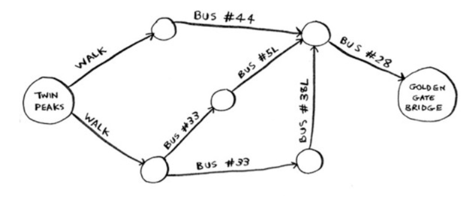
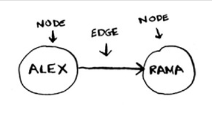
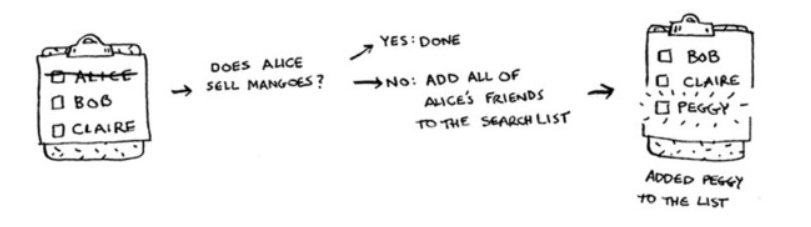
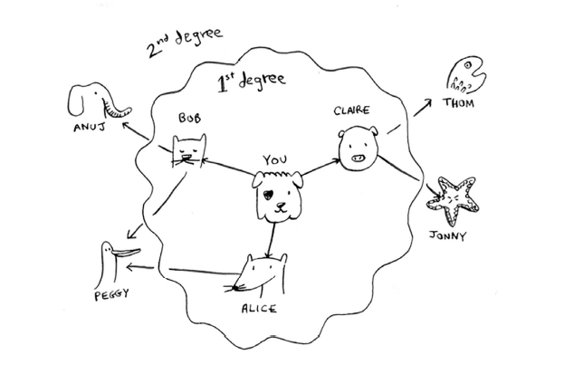
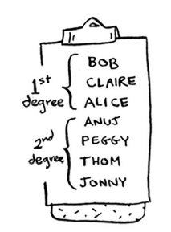
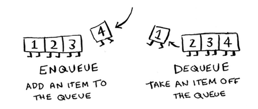
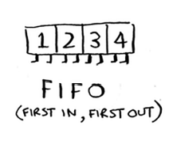
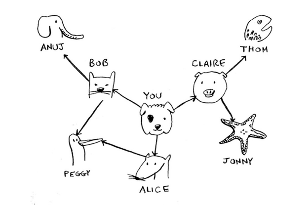
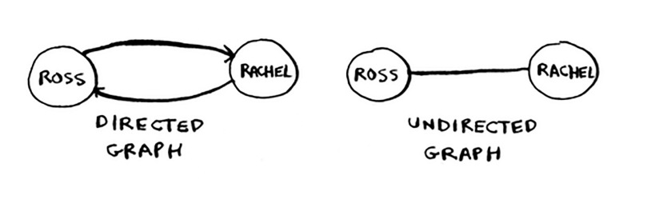

# Chapter-6 广度优先搜索(Breadth-first Search)

* 广度优先搜索(breadth-first search, BFS)：广度优先搜索能够让我们找出两样东西之间的最短距离。使用广度优先搜索我们可以：
  * [ ] 编写国际跳棋AI，计算最少走多少步就可以获胜。
  * [ ] 编写拼写检出器，计算最少编辑多少个地方就可将错拼的单词改成正确的单词，如将READED改为READER需要编辑一个地方；
  * [ ] 根据人际关系网络，找到最近的医生。

## 1. 图简介

* 最短路径问题(shortest-path problem)

* 要确定最短路径问题需要两个步骤：
  
  1. 使用图来建立问题模型。
  2. 使用广度优先搜索解决问题。

* 图由节点(node)和边(edge)组成。
  

* 一个节点可能于众多节点直接相连，这些节点被称为**邻居**。

* 图用于模拟不同的东西是如何相连的。

## 2. 广度优先搜索 

* 广度优先搜索是一种用于图的查找算法，可帮助回答两类问题：
  * [ ] 第一类问题：从节点A出发，有前往节点B的路径吗？(有没有)
  * [ ] 第二类问题：从节点A出发，前往节点B的哪条路径最短？(最短的)

* 广度优先算法举例：在朋友和朋友的朋友...中查找芒果经销商。使用**广度优先搜索**算法搜遍自己的整个人际关系网，直到找到芒果销售商。
  

### 2.1 查找最短路径



* 先查找一度关系再查找二度关系(一度关系在二度关系之前加入查找名单)

* 广度优先搜索不仅查找从A到B的路径，而且找到的还是最短的路径。
  

* 注意：只有按添加顺序查找是，才能实现这样的目的。

* 有一个可实现按添加顺序进行检查的数据结构：队列(queue)

### 2.2 队列

* 队列类似于栈，不能随机地访问队列中地元素。队列只支持两种操作：**入队**和**出队**。
  

* 队列和栈的区别：
  * 队列：**先进先出**(First in First Out, FIFO)
    
  * 栈：**后进先出**(Last in First Out)
    

## 3. 图的实现

* 散列表能让我们将键(Key)映射到值(Value)
  
  ```python
  graph = {}
  graph["you"] = ["allice", "bob", "claire"]
  graph["bob"] = ["anuj", "peggy"]
  graph["alice"] = ["peggy"]
  graph["claire"] = ["thom", "jonny"]
  graph["anuj"] = []
  graph["thom"] = []
  graph["jonny"] = [] 

  print(graph["you"])
  ```
  > graph["you"]是一个数组，其中包含了"you"的所有邻居

  * 键-值对的添加顺序不重要，对字典无影响。散列表是**无序**的。

* 注意：上述为有向图(directed graph)：如，我们可以说Anuj是Bob的邻居，但Bob不是Anuj的邻居。
* 无向图(undirected graph)没有箭头，直接相连的节点互为邻居。例如，下面两个图是等价的。
  

## 5. 实现算法

- 